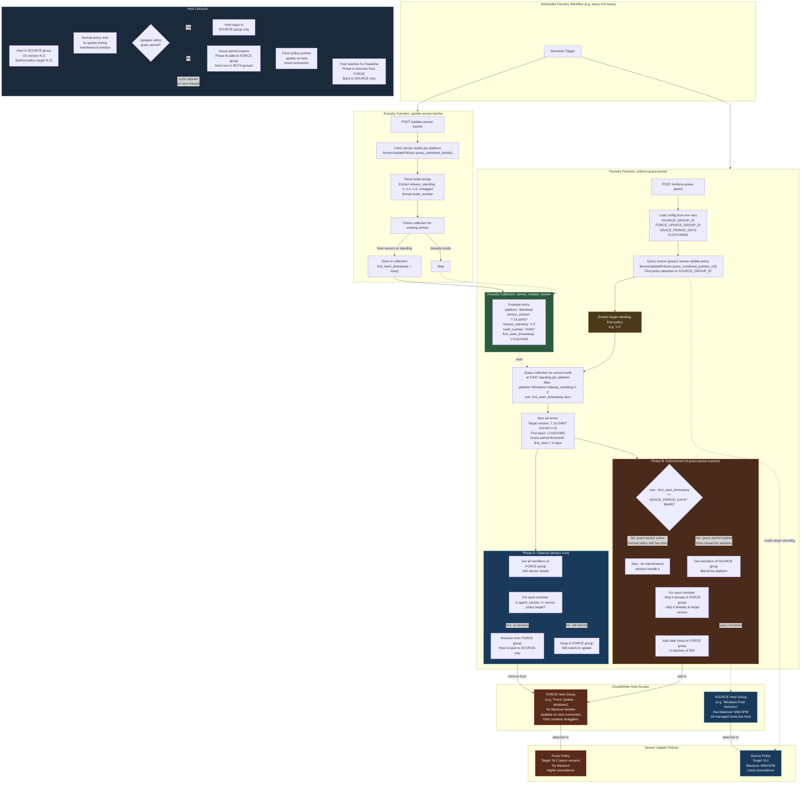

# Sensor Update Enforcer - Architecture

## Overview

This Falcon Foundry app ensures hosts stay up-to-date with the sensor version targeted by their source host group's policy, even if they're only online during business hours when updates are blacked out.

The app is built entirely on Foundry primitives: **Foundry Functions** (Python) for the logic, a **Foundry Collection** for persistent state, and **Foundry Workflows** for scheduling. No external infrastructure is required.

## Architecture Diagram

## Foundry Components

| Component | Type | Purpose |
|-----------|------|---------|
| `update-sensor-tracker` | Foundry Function (Python) | Polls sensor builds API, tracks version standings in collection |
| `enforce-grace-period` | Foundry Function (Python) | Manages force-group membership based on grace period |
| `sensor_release_tracker` | Foundry Collection | Stores version records with `first_seen_timestamp` for grace period math |
| Scheduled workflows | Foundry Workflow | Triggers both functions on a recurring schedule |

## Environment Variables

| Variable | Required | Default | Description |
|----------|----------|---------|-------------|
| `SOURCE_GROUP_ID` | Yes | | Host group ID with the normal maintenance-window policy |
| `FORCE_UPDATE_GROUP_ID` | Yes | | Host group ID with the force-update (no blackout) policy |
| `GRACE_PERIOD_DAYS` | No | `3` | Days to wait after a new version appears before forcing updates |
| `PLATFORMS` | No | `windows` | Comma-separated platforms to enforce |
| `DEBUG_MODE` | No | `false` | Enable verbose debug logging |

## Prerequisites

1. Create a **source sensor update policy** with a maintenance window (e.g. blackout 9AM-5PM) targeting a specific standing (e.g. N-2)
2. Create a **source host group** and attach it to the source policy. All managed hosts live here.
3. Create a **force update policy** targeting the **same standing** but with **no blackout window**
4. Create a **force update host group** and attach it to the force policy. This starts empty.
5. Set `SOURCE_GROUP_ID` and `FORCE_UPDATE_GROUP_ID` env vars to the respective host group IDs
6. Ensure the force policy has **higher precedence** (lower number) than the source policy
